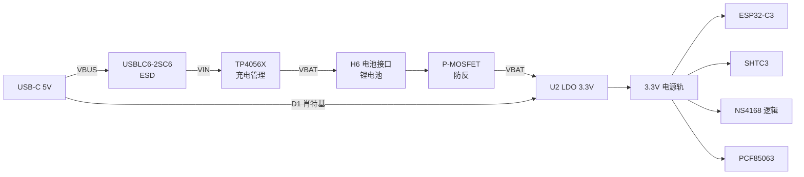
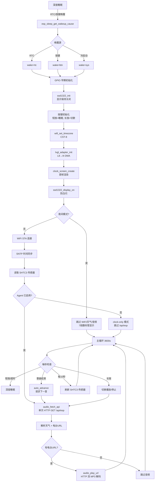
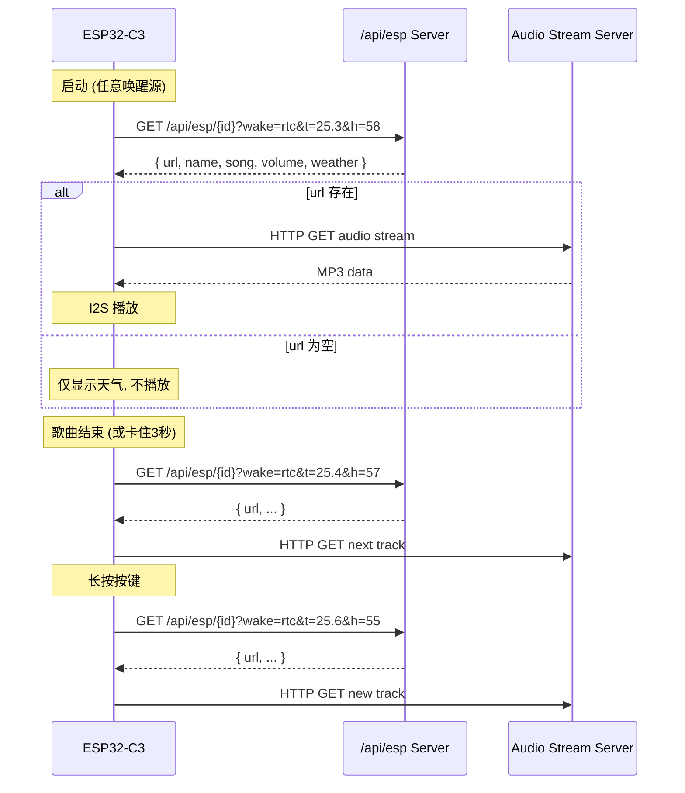
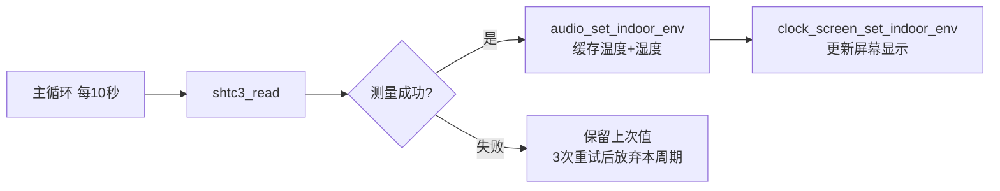
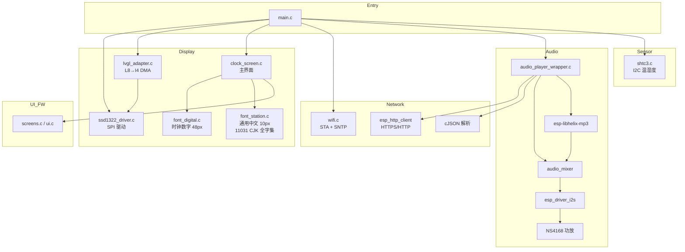

# SlumberCube 安睡小方

[](https://github.com/llinzzi/slumbercube)
[](https://www.espressif.com)
[]()
[]()

> **Slumber** = 安睡 · **Cube** = 方块 —— 床头那块陪你安稳入眠的小方块。

## 简介

一款定位于床头的AI Agent项目， 他哄你入睡，伴你睡眠，唤你起床。

特色功能：
- 🌙 **深夜极暗显示模式** — 4×4 抖动数码管 + 极暗对比度，在深夜实现无光污染的时间展现。
- 🌙 **深夜广播** — 有AI Agent驱动的小方DJ生成广播词，播报天气预报及自动下载睡眠歌单。 
- 🌙 **深夜气温检测** — 睡眠阶段采集室内温度，健康晚睡空调等是否合理。
- 🎵 **早安广播** — 早上定时唤醒，开始播报起床广播，小方DJ也进行播报。

后端服务：[llinzzi/slumbercube-server](https://github.com/llinzzi/slumbercube-server)

🎬 **演示视频**：[Bilibili BV13ETt6JEUU](https://www.bilibili.com/video/BV13ETt6JEUU)


| 线框图 | 3D 渲染图 |
|:---:|:---:|
|  |  |

## 硬件规格

> 原理图版本：Schematic1_9 · 2026-06-27 (P2 修订 2026-06-23)

### 主控
| 项目 | 规格 |
|------|------|
| 模组 | **ESP32-C3-MINI-1-N4** (RISC-V 单核, WiFi, SMD 模组) |
| Flash | 4MB DIO @ 80MHz |
| 内部 RTC | ESP32-C3 内置 RC 振荡器（精度较低, 深度睡眠期间不计时） |
| 外部 RTC | **PCF85063ATT/AJ (U3)** — 见下文"实时时钟" |
| 复位 | CHIP_PU 上拉 R5 10K, 按键 SW14 可手动复位 |

### 芯片清单

| 位号 | 型号 | 角色 |
|------|------|------|
| **U6** | **ESP32-C3-MINI-1-N4** | 主控 MCU (SMD 模组) |
| U5 | NS4168 | Class-D 数字功放 |
| **U3** | **PCF85063ATT/AJ** | **I²C 实时时钟芯片 (自带 32.768kHz 晶振)** |
| U20 | SHTC3-TR-10KS | I²C 温湿度传感器 (与 U3 共用总线) |
| U1 | TP4056X | 锂电池充电管理 |
| U2 | (LDO SOT-23-5) | 3.3V 线性稳压 |
| D1 | 1N5819WS | 防反肖特基二极管 |
| D2 | USBLC6-2SC6 | USB 数据线 ESD 保护 |
| Q1 | (P-MOSFET) | 电池防反接 |
| X1 | 32.768kHz | PCF85063 专用 RTC 晶振 (C9/C11 22pF, R10 5M 偏置) |

### 电源



| 项目 | 规格 |
|------|------|
| 输入 | USB Type-C (MC-802YC-H105), 5V, CC1/CC2 各 5.1K 下拉 |
| 充电 IC | TP4056X, PROG=R2 10K → ~130mA 充电电流 |
| 充电指示 | LED1 (CHRG#) + R1 1K |
| 防反 | D1 (1N5819WS) + Q1 (P-MOSFET, R3 10K 偏置) |
| 电池接口 | H6 2-pin 2.0mm wafer |
| 稳压 | U2 LDO, 输入/输出各 1µF 去耦 |
| OLED 供电 | 直接取自 USB 5V (H2 pin 1), 不经过电池 |

### 实时时钟 (PCF85063ATT/AJ)

板载独立 RTC 芯片，深度睡眠期间持续计时，唤醒后 ESP32-C3 通过 I²C 读取时间，避免每次 WiFi SNTP 同步。

| 项目 | 规格 |
|------|------|
| 芯片 | NXP PCF85063ATT/AJ (SO-8) |
| 接口 | I²C (与 SHTC3 共用 SCL/SDA 总线, 地址 0x51) |
| 晶振 | 外置 32.768kHz (X1 + C9/C11 22pF + R10 5M 偏置) |
| 中断输出 | INT# → ESP32-C3 **IO0** (RTC_INT, 可作秒中断/闹钟唤醒) |
| 精度 | 取决于晶振, 典型 ±20 ppm @ 25°C |
| 去耦 | C17 100nF |

> **设计动机**：ESP32-C3 内置 RTC 在深度睡眠时若使用内部 RC 振荡器会丢失精度，外部 32.768kHz 晶振本应直接接到 ESP32-C3 的 XTAL_32K 脚。新版原理图把晶振挪到了 PCF85063，由 PCF85063 独立计时，ESP32-C3 唤醒后再去 I²C 读——这样深度睡眠期间 ESP32-C3 内部 RTC 完全断电也无所谓。

### 显示
| 项目 | 规格 |
|------|------|
| 型号 | SSD1322 |
| 分辨率 | 256×64 灰度 OLED |
| 接口 | SPI 10MHz, I4 灰度 (16 级) |
| 连接器 | H2 PM254-2-08-S-8.5 (8-pin 2.54mm) |
| 供电 | 5V (从 USB VBUS 直接取电) |

### 音频
| 项目 | 规格 |
|------|------|
| 功放 | NS4168 Class-D |
| 接口 | I2S (ESP32-C3 → NS4168) |
| 输出 | 差分 VON/VOP, 经 L1/L2 + C14/C15 (1nF) LC 滤波 |
| 喇叭接口 | H5 2-pin 2.0mm wafer |
| 关断 | NS_CTRL 低电平 = 关功放 |

### 温湿度 & RTC (I²C 总线)

| 项目 | 规格 |
|------|------|
| 总线 | I²C, SCL = IO9, SDA = IO21 |
| 上拉 | R41/R42 各 4.7K → 3.3V |
| 设备 1 | Sensirion SHTC3 (地址 0x70) — 温湿度 |
| 设备 2 | NXP PCF85063ATT/AJ (地址 0x51) — RTC |

> 两设备共用同一 I²C 总线，靠地址区分。

### 按键

| 位号 | 型号 | 接至 | 触发 | 功能 |
|------|------|------|------|------|
| SW1 | TC-6615-5-260G (侧按 5mm) | IO1 | 低电平 | 预留按键 (固件未启用) |
| SW12 | TC-6615-5-260G (侧按 5mm) | IO3 | 低电平 | 主按键：短按睡眠 / 长按切歌 / 深度睡眠唤醒 |
| SW13 | TS342A2P 160gf | **IO9** ⚠️ | 低电平 | 预留按键（**三重共用**, 见下） |
| SW14 | TS342A2P 160gf | CHIP_PU/EN | 低电平 | 硬件复位 |

> ⚠️ **IO9 三重共用**：SW13、SHTC3 SCL、PCF85063 SCL 都接到 IO9。I²C 总线空闲时 SW13 按下会把 SCL 拉低，可能导致 I²C 通信失败。固件目前仅使用 SW12（IO3）和 SW1（IO1 未启用），SW13 暂留空。

### USB 与接口

| 接口 | 型号 | 用途 |
|------|------|------|
| USB-C | MC-802YC-H105 | 充电输入（5V） |
| H5 | WAFER-PH2.0-2PWB | 锂电池接入 |
| H6 | WAFER-PH2.0-2PWB | 喇叭接入 |
| H2 | PM254-2-08-S-8.5 | OLED 模组接入 |

USB 数据线 D+_OUT/D-_OUT 经 USBLC6-2SC6 ESD 后直连 ESP32-C3 原生 USB (IO19/IO18)，本固件未使用 USB CDC（仍走串口烧录）。

### GPIO 配置

| GPIO | 功能 | 连接 | 备注 |
|------|------|------|------|
| **IO0** | **RTC_INT** | **PCF85063 INT#** | RTC 闹钟/秒中断输出, 可唤醒 ESP32-C3 |
| IO1 | KEY (预留) | SW1 | 固件未启用 |
| IO2 | NS_CTRL | NS4168 CTRL | 功放关断, 低 = 静音 |
| **IO3** | **KEY / WAKEUP** | **SW12** | **深度睡眠唤醒, 短按/长按识别** |
| IO4 | I2S_SDIN | NS4168 SDATA | |
| IO5 | I2S_SCLK | NS4168 BCLK | |
| IO6 | I2S_LRCLK | NS4168 LRCLK | |
| IO7 | SPI_SCK | SSD1322 SCLK | |
| IO8 | SPI_DC | SSD1322 DC | |
| **IO9** | **I2C_SCL (三重共用)** | **SHTC3 + PCF85063 + SW13** | ⚠️ 三方复用, 固件仅作 I²C 用 |
| IO10 | SPI_SDA | SSD1322 MOSI | |
| IO18 | USB_D-_OUT | USB-C D- | 原生 USB, 固件未用 |
| IO19 | USB_D+_OUT | USB-C D+ | 原生 USB, 固件未用 |
| IO20 | SPI_RST | SSD1322 RST | 深度睡眠期间 GPIO hold 拉低 |
| IO21 | I2C_SDA | SHTC3 SDA + PCF85063 SDA | R42 4.7K 上拉, 总线共享 |
| CHIP_PU | EN | SW14 + R5 10K 上拉 | 复位按键, 高 = 运行 |

> SPI CS 硬件接地（SSD1322 始终选中）。
> 唤醒 GPIO 与主按键共用 IO3。
> ESP32-C3 **不再**外接 32.768kHz 晶振（晶振移到 PCF85063）。

---

## 程序启动流程



---

## 屏幕布局

```
y=0   ┌──────────────────────────────────────────────┐
      │ 左: 16:30 (digital-7 48px)   右: 小雨 22°(内25.3°58%)  │
y=18  │                                    22° - 30°         │
y=36  │              [ 歌曲名居中滚动 ]                          │
      └──────────────────────────────────────────────┘
                        256×64 SSD1322
```

| 区域 | 字体 | 内容 |
|------|------|------|
| 时间 | `lv_font_digital` (digital-7, 48px, 4bpp) | HH:MM |
| 天气行 | `lv_font_station` (fusion-pixel, 10px, 1bpp) | 天气文字 + 当前温度 + 室内温湿度 |
| 温度行 | `lv_font_station` | 今日最低温度 – 最高温度 |
| 歌名行 | `lv_font_station` | 歌曲名, 居中滚动 |

---

## 夜间模式

触发条件: 22:00–6:00

- 显示切换到 Canvas 7 段数码管 (12px 灰度像素, 8×8 网格抖动)
- 对比度降到 `0x01` (极暗)
- 跳过 WiFi、天气、SHTC3、音频 — 纯时钟

---

## 唤醒机制

| 唤醒来源 | `?wake=` | 触发条件 |
|--------|----------|----------|
| **PCF85063 外部 RTC 闹钟** | `rtc` | IO0 (`RTC_INT`) 收到 PCF85063 闹钟中断，**主要唤醒来路**（默认 7:50；Server 可用 `alarm.time` 在 `/api/esp` 响应里覆盖，存入 PCF85063 闹钟寄存器） |
| ESP32-C3 内部 RTC 定时器 | `rtc` | PCF85063 不可用 / 未配置时的 fallback，由 `esp_sleep_enable_timer_wakeup()` 触发 |
| GPIO3 按键 (SW12) | `btn` | 短按 = 睡眠，长按 = 切歌，三击 = 重置配网 |
| 冷启动 (上电/烧录) | `sys` | 第一次启动 |

唤醒源在启动最早期通过 `esp_sleep_get_wakeup_cause()` 检测，随后拼接到 `/api/esp` URL 中。

> **注意**：`ESP_SLEEP_WAKEUP_GPIO` 这一路会被两个引脚共用——`CONFIG_PCF85063_INT_GPIO` (IO0) 走 rtc 分支、其它命中走 btn 分支（`main.c` L232-245）。

---

## /api/esp API 规范

### 请求

```
GET http://{server}:3000/api/esp/{device_id}?wake={src}&t={temp}&h={humidity}
```

| 参数 | 类型 | 示例 | 说明 |
|------|------|------|------|
| `device_id` | path | `543204470994` | ESP32-C3 MAC 地址 (12 hex) |
| `wake` | query | `rtc` / `btn` / `sys` | 唤醒源 |
| `t` | query | `25.3` | 室内温度 °C (SHTC3, 可选) |
| `h` | query | `58` | 室内湿度 %RH (SHTC3, 可选) |

### 响应 JSON

```json
{
  "url": "http://stream.example.com/track.mp3",
  "name": "电台名称",
  "song": "当前歌曲",
  "volume": 50,
  "weather": {
    "temp": "26",
    "text": "小雨",
    "humidity": "85",
    "tempMax": "30",
    "tempMin": "22",
    "textDay": "小雨",
    "textNight": "阴"
  },
  "alarm": {
    "enabled": true,
    "time": "07:50",
    "weekend_saturday": false,
    "weekend_sunday": true
  }
}
```

| 字段 | 类型 | 说明 |
|------|------|------|
| `url` | string | 音频流 URL, 为空字符串则不播放 |
| `name` | string | 电台/专辑名 |
| `song` | string | 当前歌曲名, 优先显示 |
| `volume` | number | 音量 0.0–1.0 或 0–100 |
| `weather.temp` | string | 当前温度 |
| `weather.text` | string | 天气描述 (晴/多云/阴/雨/雪/雾/风 等) |
| `weather.humidity` | string | 室外湿度 |
| `weather.tempMax` | string | 今日最高温 |
| `weather.tempMin` | string | 今日最低温 |
| `weather.textDay` | string | 白天天气 |
| `weather.textNight` | string | 夜间天气 |
| `alarm.enabled` | bool | 是否启用 PCF85063 外部 RTC 闹钟唤醒；`false` → 走 ESP32-C3 内部 RTC 定时器 fallback |
| `alarm.time` | string | 闹钟时间，`"HH:MM"` 24h 制，写入 PCF85063 闹钟寄存器；缺省回退到 `CONFIG_WAKEUP_HOUR/MINUTE` |
| `alarm.weekend_saturday` | bool | 周六是否触发闹钟（`false` = 跳过当天，避免周末被吵醒） |
| `alarm.weekend_sunday` | bool | 周日是否触发闹钟（`false` = 跳过当天） |

### 响应示例 (无音乐)

```json
{
  "weather": { "temp": "26", "text": "晴", "humidity": "50", "tempMax": "32", "tempMin": "22", "textDay": "晴", "textNight": "多云" }
}
```

> `url` 缺失或为空 → 不启动音频播放, 仅显示天气。

### 请求时机



> 启动阶段只发 **一次** HTTP GET: `audio_fetch_api()` 同时解析天气和电台 URL, `audio_play_url()` 判断 URL 已缓存则直接播放, 不再重复请求。

---

## 无 Agent 模式（配置 Server 地址）

设备支持 **完全跳过 Agent 后端** 的运行模式——只显示时间 + 室内温湿度，不发起 `/api/esp` 请求，不播放音频。这种模式在 captive portal（SoftAP 配网页面）上配置。

### 配置入口

三击按键进入 WiFi 配网页面后，表单最下方多出两项：

| 字段 | 说明 |
|------|------|
| ☑ **配置安睡小方Agent** | 复选框；未勾选 = 整机退化为无 Agent 模式 |
| Server 地址 | 文本输入，默认 `192.168.8.192`（只填 host；端口 `:3000` 和路径 `/api/esp` 写死） |

### 行为差异

| 模式 | `/api/esp` 请求 | 天气显示 | 音频播放 | 屏幕底部 |
|------|----------------|---------|---------|---------|
| 启用 Agent（默认） | ✅ | ✅ | ✅ | 电台名 + 歌曲 |
| **无 Agent 模式** | ❌ 跳过 | 仅默认图标 | ❌ 跳过 | 仅时间 + 室内温湿度 |

未勾选复选框时：
- `audio_fetch_api()` 直接返回 `ESP_ERR_NOT_SUPPORTED`，整个 HTTP 流程短路
- `audio_play_url()` 同样短路，长按按键不会播放
- 复选框未勾选但 host 输入框仍保留之前保存的地址——重新勾选即恢复，不必重输

### 数据存储

| 字段 | NVS namespace | Key | 类型 |
|------|--------------|-----|------|
| Host | `agent_cfg` | `host` | string (≤ 64) |
| 启用标志 | `agent_cfg` | `enabled` | uint8 (0/1) |

与 `wifi_cfg`、`clock` 命名空间平行。`wifi_creds_clear()` 不会动 `agent_cfg`，反之亦然。

### Host 校验

`api_wifi_handler` 在保存前调用 `sanitize_host()`：
- 空字符串 / `NULL` → `192.168.8.192`
- 包含 `:`、`/`、空格 → `192.168.8.192`（回退到默认 + 写一条 WARN）

`/api/esp` 的端口 `:3000` 和路径 `/api/esp` 是与后端的契约，**用户不可配置**。

### 重新配置

三击按键 → SoftAP 重新启动 → 提交新表单 → 设备保存到 NVS → 自动重启 3 秒。重启后 `audio_init()` 从 NVS 重新读取 host + enabled。

---

## 温度传感器 (SHTC3)



- **芯片**: Sensirion SHTC3 (I2C, 0x70)
- **引脚**: GPIO9 (SCL), GPIO21 (SDA)
- **读取频率**: 每 10 秒
- **容错**: 每次读取尝试 3 种策略 (正常 → 软复位 → Clock Stretching), 失败后跳过本次, 10 秒后自动重试
- **数据用途**: 屏幕显示 `(内25.3°58%)` + 作为 `?t=&h=` 参数随下次 `/api/esp` 请求发送

---

## 软件架构



### 核心模块

| 模块 | 文件 | 说明 |
|------|------|------|
| 入口 | `main.c` | 初始化 + 主循环 + 深度睡眠 + 唤醒检测 + SHTC3 定时刷新 |
| 显示驱动 | `ssd1322_driver.c/h` | SSD1322 SPI 命令, 复位序列, 对比度控制 |
| LVGL 适配 | `lvgl_adapter.c/h` | LVGL flush callback, L8→I4 格式转换 |
| WiFi/对时 | `wifi.c/h` | STA 连接, SNTP 同步, 设备 ID (MAC) |
| WiFi 配网 | `wifi_provisioning.c/h` | SoftAP + DNS 重定向 + captive portal + QR |
| Agent 配置 | `agent_config.c/h` | NVS `agent_cfg` 命名空间, host + enabled |
| 天气/电台 API | `audio_player_wrapper.c/h` | `/api/esp` HTTP + JSON 解析 + I2S 音频播放 |
| 屏幕 UI | `clock_screen.c/h` | 时间/天气/温度/歌名布局 + Canvas 绘制 |
| SHTC3 驱动 | `components/shtc3/shtc3.c/h` | I2C 传感器读取, CRC8 校验 |
| UI 框架 | `ui/screens.c, ui/styles.c, ui/ui.c` | EEZ Studio 生成 |
| 数字字体 | `font_digital.c/h` | digital-7 48px 4bpp (时钟) |
| 通用字体 | `font_station.c/h` | fusion-pixel 10px 1bpp (11031 CJK + ASCII + 标点) |

---

## 构建

```bash
# 环境
. ~/esp/esp-idf/export.sh      # 适配你的 ESP-IDF 路径

# 构建
idf.py build

# 烧录 (macOS 通常用 /dev/cu.usbmodem*)
idf.py -p /dev/cu.usbmodem1301 flash

# 串口监视
idf.py -p /dev/cu.usbmodem1301 monitor
```

### 分区表

| 分区 | 大小 | 说明 |
|------|------|------|
| bootloader | 32KB | |
| partition table | 4KB | |
| nvs | 24KB | WiFi 凭证等 |
| phy_init | 4KB | |
| factory | 4032K (3.94MB) | 单 app 分区, 最大化利用 4MB Flash |

### 字体生成

```bash
lv_font_conv --size 10 --bpp 1 --format lvgl --no-compress --lv-include lvgl.h \
  --font assets/fonts/fusion-pixel-10px-monospaced-zh_hans.ttf \
  -r 0x0020-0x007F -r 0x00A0-0x00FF -r 0x2000-0x206F \
  -r 0x3000-0x303F -r 0xFF00-0xFFEF \
  -r 0x4E00-0x9FFF -r 0x3400-0x4DBF \
  --output main/font_station.c --lv-font-name lv_font_station
```

> Unicode 范围覆盖: Basic Latin, Latin-1 Supplement, General Punctuation, CJK 标点, 全角字符, CJK 统一汉字 (GB2312/GB18030)

---

## 配置

`idf.py menuconfig` → SlumberCube Configuration

| 分类 | 选项 | 说明 |
|------|------|------|
| WiFi | SSID, 密码 | |
| Sleep | 活跃时长, 唤醒 GPIO, 闹钟时间 | 默认 3600s, GPIO3, 7:50 |
| Night | 开始/结束小时 | 默认 22→6 |
| Audio | 默认音量 | 0–100 |
| GPIO | SPI/I2S/NS4168/按键 | 默认值见上文 GPIO 连接表 |

---

## 防白闪机制

深度睡眠唤醒时, SSD1322 GDDRAM 内容随机, 如果显示过早打开会出现白闪。

**修复策略** (多层防护):

1. 睡眠前 GPIO hold 拉低 RST → SSD1322 在睡眠期间保持复位
2. `ssd1322_init()` 复位后立即发 `0xAE` → 显示关断
3. `lv_screen_load()` 在 `lv_refr_now()` 之前 → 渲染用户黑底界面, 而非 LVGL 默认白底
4. 首帧渲染完成后才调用 `ssd1322_display_on()` → GDDRAM 中已是正确内容

---

## 依赖

| 组件 | 说明 |
|------|------|
| lvgl/lvgl ^9.4 | 图形库 |
| espressif/button ^4.1 | GPIO 按键 |
| chmorgan/esp-libhelix-mp3 | MP3 解码 |
| esp-audio-player | 音频框架 (HTTP 流 + 混音器 + I2S) |
| ESP-IDF >=5.0 | 开发框架 |

---

## 硬件设计文件

| 文件 | 路径 |
|------|------|
| 原理图 (PDF, 2026-06-27) | `assets/hardware/SCH_Schematic1_9_2026-06-27.pdf` |
| 3D 外壳 (Shapr3D 原生) | `assets/hardware/安睡小方.shapr` |
| 3D 外壳 (STEP 通用格式) | `assets/hardware/安睡小方.step` |
| Gerber 文件 | _待生成（基于 2026-06-27 原理图）_ |

---

*SlumberCube 安睡小方 · 固件 v2.2 · 2026-06-27 · 原理图 Schematic1_9*
