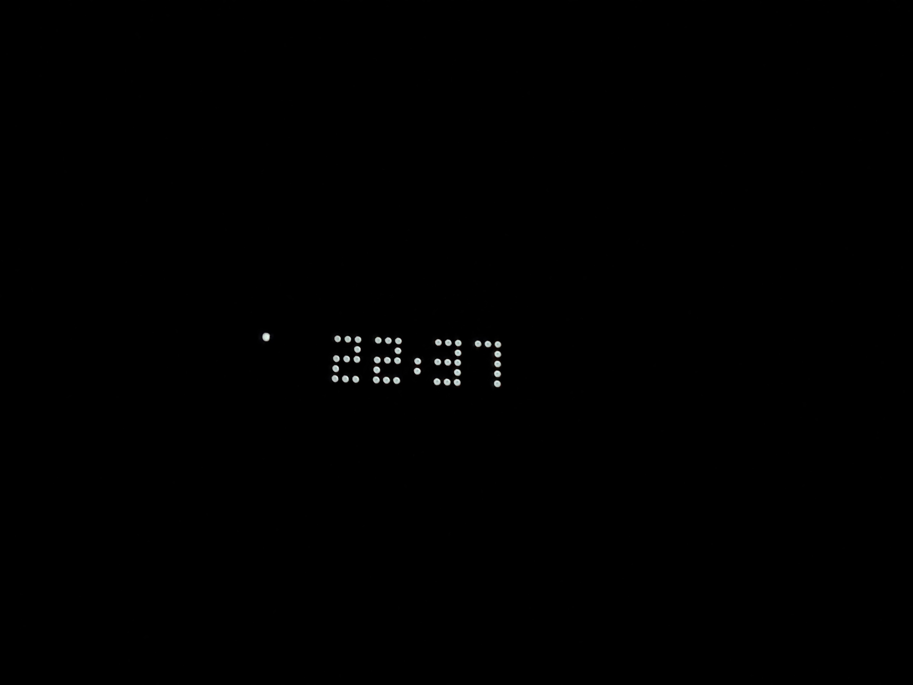
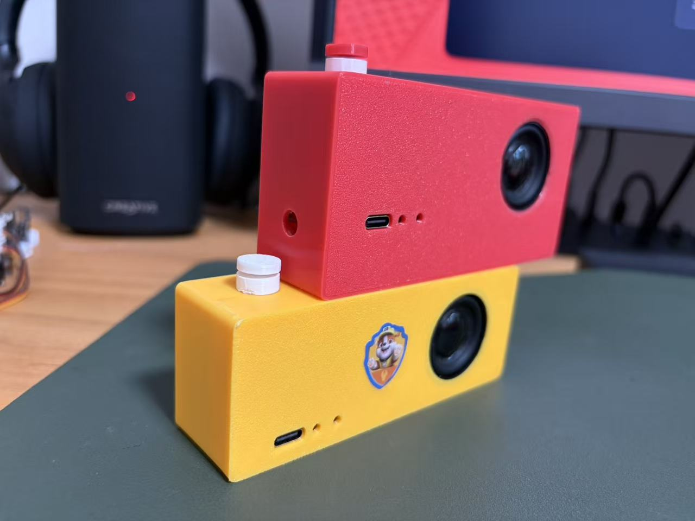
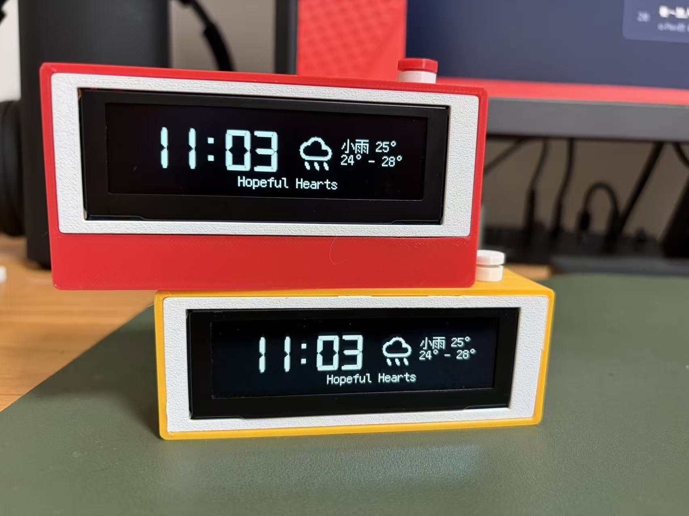
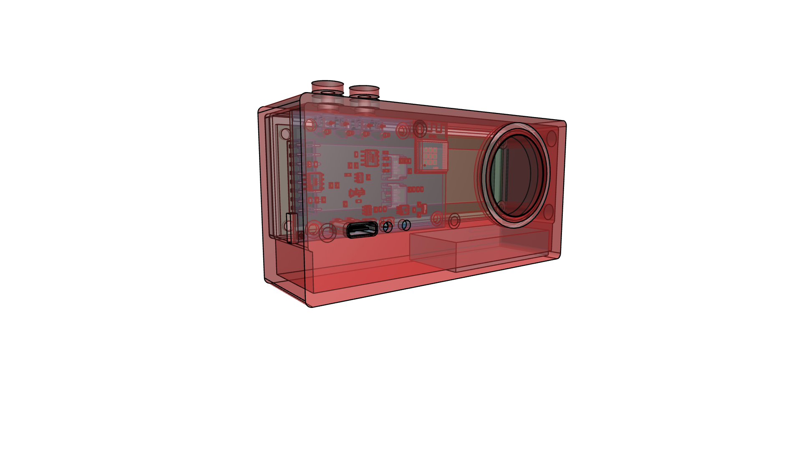
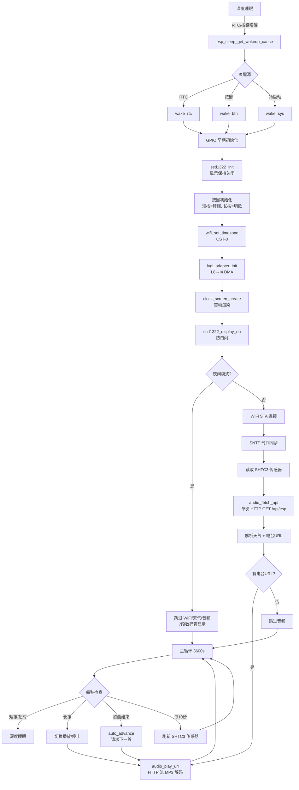
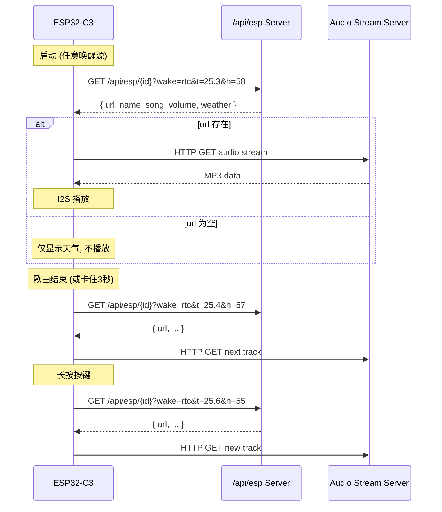
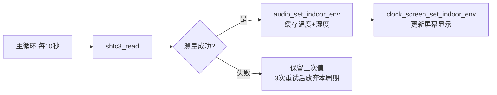
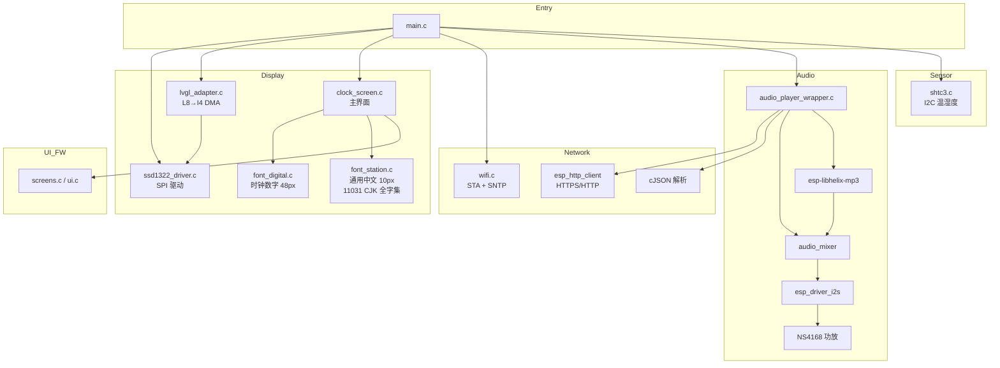

# SlumberCube 安睡小方

[](https://github.com/llinzzi/slumbercube)
[](https://www.espressif.com)
[]()
[]()

> **Slumber** = 安睡 · **Cube** = 方块 —— 床头那块陪你安稳入眠的小方块。

## 简介

基于 **ESP-IDF 5.5** 框架的床头睡眠时钟固件，驱动 **256×64 SSD1322** 灰度 OLED 显示屏。集 WiFi 自动对时、AMAP 天气、`/api/esp` 电台流媒体、I2S 音频播放、SHTC3 室内温湿度传感、按键交互和深度休眠于一体。

夜间自动切换低亮数码管模式；白天/夜间整机会深度休眠，按键或定时唤醒。

主要能力：

- 🕒 **大字时钟** — 48px digital-7 数字显示，灰度 16 级
- 🌤 **天气 + 室内温湿度** — AMAP 接口，SHTC3 传感器
- 🎵 **电台流媒体** — HTTP MP3 流，I2S → NS4168 功放
- 🌙 **夜间模式** — 4×4 抖动数码管 + 极暗对比度，22:00–6:00
- 💤 **深度休眠** — 默认凌晨 7:50 RTC 定时唤醒，按键随时唤醒
- 📐 **方正造型** — 4 层 PCB + 亚克力外壳，整机一手可握






| 线框图 | 3D 渲染图 |
|:---:|:---:|
|  |  |

## 硬件规格

### 主控
| 项目 | 规格 |
|------|------|
| 模组 | ESP32-C3-WROOM-02 (RISC-V 单核, WiFi/BT) |
| Flash | 4MB DIO @ 80MHz |
| RTC | 32.768kHz 晶振 |

### 显示
| 项目 | 规格 |
|------|------|
| 型号 | SSD1322 |
| 分辨率 | 256×64 灰度 OLED |
| 接口 | SPI 10MHz, I4 灰度 (16 级) |

### GPIO 连接

| GPIO | 功能 | 连接 |
|------|------|------|
| 2 | NS_CTRL | NS4168 功放关断 |
| 3 | KEY / WAKEUP | 用户按键 (短按睡眠, 长按切歌, 深度睡眠唤醒) |
| 4 | I2S_SDIN | NS4168 数据 |
| 5 | I2S_SCLK | NS4168 时钟 |
| 6 | I2S_LRCLK | NS4168 声道 |
| 7 | SPI_SCK | SSD1322 SCLK |
| 8 | SPI_DC | SSD1322 DC |
| 9 | I2C_SCL | SHTC3 温湿度传感器 |
| 10 | SPI_SDA | SSD1322 MOSI |
| 20 | SPI_RST | SSD1322 RST |
| 21 | I2C_SDA | SHTC3 温湿度传感器 |

> SPI CS 硬件接地。唤醒 GPIO 和按键共用 GPIO3。

---

## 程序启动流程



---

## 屏幕布局

```
y=0   ┌──────────────────────────────────────────────┐
      │ 左: 16:30 (digital-7 48px)   右: 小雨 22°(内25.3°58%)  │
y=18  │                                    22° - 30°         │
y=36  │              [ 歌曲名居中滚动 ]                          │
      └──────────────────────────────────────────────┘
                        256×64 SSD1322
```

| 区域 | 字体 | 内容 |
|------|------|------|
| 时间 | `lv_font_digital` (digital-7, 48px, 4bpp) | HH:MM |
| 天气行 | `lv_font_station` (fusion-pixel, 10px, 1bpp) | 天气文字 + 当前温度 + 室内温湿度 |
| 温度行 | `lv_font_station` | 今日最低温度 – 最高温度 |
| 歌名行 | `lv_font_station` | 歌曲名, 居中滚动 |

---

## 夜间模式

触发条件: 22:00–6:00

- 显示切换到 Canvas 7 段数码管 (12px 灰度像素, 8×8 网格抖动)
- 对比度降到 `0x01` (极暗)
- 跳过 WiFi、天气、SHTC3、音频 — 纯时钟

---

## 唤醒机制

| 唤醒源 | `?wake=` | 说明 |
|--------|----------|------|
| RTC 定时器 (默认 7:50) | `rtc` | 每天定时唤醒 |
| GPIO3 按键 | `btn` | 手动按按键唤醒 |
| 冷启动 (上电/烧录) | `sys` | 第一次启动 |

唤醒源在启动最早期通过 `esp_sleep_get_wakeup_cause()` 检测，随后拼接到 `/api/esp` URL 中。

---

## /api/esp API 规范

### 请求

```
GET http://{server}:3000/api/esp/{device_id}?wake={src}&t={temp}&h={humidity}
```

| 参数 | 类型 | 示例 | 说明 |
|------|------|------|------|
| `device_id` | path | `543204470994` | ESP32-C3 MAC 地址 (12 hex) |
| `wake` | query | `rtc` / `btn` / `sys` | 唤醒源 |
| `t` | query | `25.3` | 室内温度 °C (SHTC3, 可选) |
| `h` | query | `58` | 室内湿度 %RH (SHTC3, 可选) |

### 响应 JSON

```json
{
  "url": "http://stream.example.com/track.mp3",
  "name": "电台名称",
  "song": "当前歌曲",
  "volume": 50,
  "weather": {
    "temp": "26",
    "text": "小雨",
    "humidity": "85",
    "tempMax": "30",
    "tempMin": "22",
    "textDay": "小雨",
    "textNight": "阴"
  }
}
```

| 字段 | 类型 | 说明 |
|------|------|------|
| `url` | string | 音频流 URL, 为空字符串则不播放 |
| `name` | string | 电台/专辑名 |
| `song` | string | 当前歌曲名, 优先显示 |
| `volume` | number | 音量 0.0–1.0 或 0–100 |
| `weather.temp` | string | 当前温度 |
| `weather.text` | string | 天气描述 (晴/多云/阴/雨/雪/雾/风 等) |
| `weather.humidity` | string | 室外湿度 |
| `weather.tempMax` | string | 今日最高温 |
| `weather.tempMin` | string | 今日最低温 |
| `weather.textDay` | string | 白天天气 |
| `weather.textNight` | string | 夜间天气 |

### 响应示例 (无音乐)

```json
{
  "weather": { "temp": "26", "text": "晴", "humidity": "50", "tempMax": "32", "tempMin": "22", "textDay": "晴", "textNight": "多云" }
}
```

> `url` 缺失或为空 → 不启动音频播放, 仅显示天气。

### 请求时机



> 启动阶段只发 **一次** HTTP GET: `audio_fetch_api()` 同时解析天气和电台 URL, `audio_play_url()` 判断 URL 已缓存则直接播放, 不再重复请求。

---

## 温度传感器 (SHTC3)



- **芯片**: Sensirion SHTC3 (I2C, 0x70)
- **引脚**: GPIO9 (SCL), GPIO21 (SDA)
- **读取频率**: 每 10 秒
- **容错**: 每次读取尝试 3 种策略 (正常 → 软复位 → Clock Stretching), 失败后跳过本次, 10 秒后自动重试
- **数据用途**: 屏幕显示 `(内25.3°58%)` + 作为 `?t=&h=` 参数随下次 `/api/esp` 请求发送

---

## 软件架构



### 核心模块

| 模块 | 文件 | 说明 |
|------|------|------|
| 入口 | `main.c` | 初始化 + 主循环 + 深度睡眠 + 唤醒检测 + SHTC3 定时刷新 |
| 显示驱动 | `ssd1322_driver.c/h` | SSD1322 SPI 命令, 复位序列, 对比度控制 |
| LVGL 适配 | `lvgl_adapter.c/h` | LVGL flush callback, L8→I4 格式转换 |
| WiFi/对时 | `wifi.c/h` | STA 连接, SNTP 同步, 设备 ID (MAC) |
| 天气/电台 API | `audio_player_wrapper.c/h` | `/api/esp` HTTP + JSON 解析 + I2S 音频播放 |
| 屏幕 UI | `clock_screen.c/h` | 时间/天气/温度/歌名布局 + Canvas 绘制 |
| SHTC3 驱动 | `components/shtc3/shtc3.c/h` | I2C 传感器读取, CRC8 校验 |
| UI 框架 | `ui/screens.c, ui/styles.c, ui/ui.c` | EEZ Studio 生成 |
| 数字字体 | `font_digital.c/h` | digital-7 48px 4bpp (时钟) |
| 通用字体 | `font_station.c/h` | fusion-pixel 10px 1bpp (11031 CJK + ASCII + 标点) |

---

## 构建

```bash
# 环境
. ~/esp/esp-idf/export.sh      # 适配你的 ESP-IDF 路径

# 构建
idf.py build

# 烧录 (macOS 通常用 /dev/cu.usbmodem*)
idf.py -p /dev/cu.usbmodem1301 flash

# 串口监视
idf.py -p /dev/cu.usbmodem1301 monitor
```

### 分区表

| 分区 | 大小 | 说明 |
|------|------|------|
| bootloader | 32KB | |
| partition table | 4KB | |
| nvs | 24KB | WiFi 凭证等 |
| phy_init | 4KB | |
| factory | 4032K (3.94MB) | 单 app 分区, 最大化利用 4MB Flash |

### 字体生成

```bash
lv_font_conv --size 10 --bpp 1 --format lvgl --no-compress --lv-include lvgl.h \
  --font assets/fonts/fusion-pixel-10px-monospaced-zh_hans.ttf \
  -r 0x0020-0x007F -r 0x00A0-0x00FF -r 0x2000-0x206F \
  -r 0x3000-0x303F -r 0xFF00-0xFFEF \
  -r 0x4E00-0x9FFF -r 0x3400-0x4DBF \
  --output main/font_station.c --lv-font-name lv_font_station
```

> Unicode 范围覆盖: Basic Latin, Latin-1 Supplement, General Punctuation, CJK 标点, 全角字符, CJK 统一汉字 (GB2312/GB18030)

---

## 配置

`idf.py menuconfig` → SlumberCube Configuration

| 分类 | 选项 | 说明 |
|------|------|------|
| WiFi | SSID, 密码 | |
| Sleep | 活跃时长, 唤醒 GPIO, 闹钟时间 | 默认 3600s, GPIO3, 7:50 |
| Night | 开始/结束小时 | 默认 22→6 |
| Audio | 默认音量 | 0–100 |
| GPIO | SPI/I2S/NS4168/按键 | 默认值见上文 GPIO 连接表 |

---

## 防白闪机制

深度睡眠唤醒时, SSD1322 GDDRAM 内容随机, 如果显示过早打开会出现白闪。

**修复策略** (多层防护):

1. 睡眠前 GPIO hold 拉低 RST → SSD1322 在睡眠期间保持复位
2. `ssd1322_init()` 复位后立即发 `0xAE` → 显示关断
3. `lv_screen_load()` 在 `lv_refr_now()` 之前 → 渲染用户黑底界面, 而非 LVGL 默认白底
4. 首帧渲染完成后才调用 `ssd1322_display_on()` → GDDRAM 中已是正确内容

---

## 依赖

| 组件 | 说明 |
|------|------|
| lvgl/lvgl ^9.4 | 图形库 |
| espressif/button ^4.1 | GPIO 按键 |
| chmorgan/esp-libhelix-mp3 | MP3 解码 |
| esp-audio-player | 音频框架 (HTTP 流 + 混音器 + I2S) |
| ESP-IDF >=5.0 | 开发框架 |

---

## 硬件设计文件

| 文件 | 路径 |
|------|------|
| 原理图 (PDF) | `assets/hardware/SCH_Schematic1_9_2026-06-21.pdf` |
| Gerber 文件 (ZIP) | `assets/hardware/Gerber_PCB1_9_2026-06-21.zip` |

---

*SlumberCube 安睡小方 · 固件 v2.2 · 2026-06-27*
