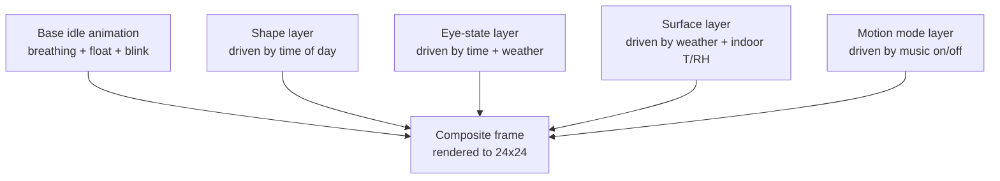
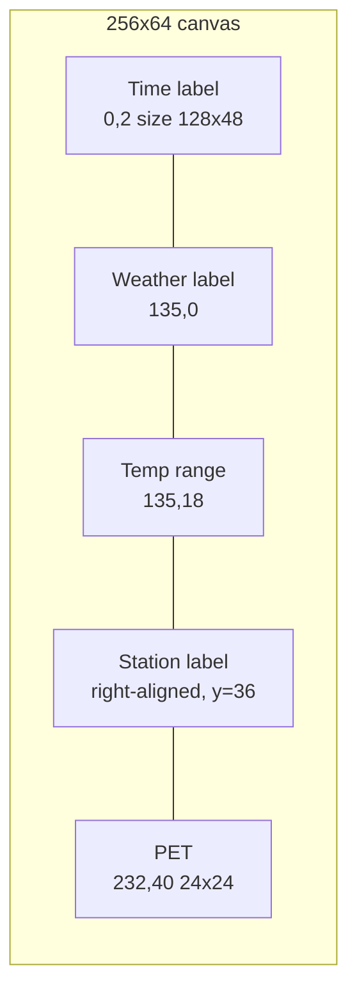

## Goal Capsule

| Field | Value |
|---|---|
| **Objective** | Add a passive ambient "pixel pet" — an abstract blob creature — to the bedside clock's UI that reflects four environmental signals (time of day, outdoor weather, indoor T/RH, music playback) without adding interaction burden. |
| **Product authority** | SlumberCube (bedside clock product line, single-user device on ESP32-C3 firmware). |
| **Execution profile** | `code` — firmware feature on the existing main MCU. No new product line, no cloud dependency, no companion app. |
| **Stop conditions** | Pet renders on the existing canvas; behavior is purely passive; night mode hides it; pet resets on each wake. No new screens, no new buttons, no audio output from the pet. |
| **Tail ownership** | Pet lives in `clock_screen.c` (or a small new module pulled into the same draw loop); evolves when product requirements change. |

## Product Contract

### Summary

A passive abstract blob creature lives in the bottom-right 24×24 pixels of the clock screen, alongside the weather panel. Four environmental signals — time of day, outdoor weather, indoor T/RH, and music playback — each toggle an internal property layer (shape, eye state, surface texture, motion mode) on top of an always-running idle animation. Reactions are coherent within a wake cycle and reset on deep sleep; the pet hides during night mode and never reacts to user input.

### Problem Frame

SlumberCube today is purely informational: clock digits, weather text, indoor temperature, forecast range, and a station label. The OLED surface is dense with data and cold by design. A bedside device earns emotional warmth from one small living thing on screen — a creature that quietly reflects the environment rather than demanding attention. The challenge is to add that warmth without breaking what already works: the device's promise of "inform without intruding," the strict night-mode contrast budget, the 10-minute wake / deep-sleep rhythm, and the existing 256×64 grayscale canvas that already carries the clock + weather UI.

### Key Decisions

**Pet form: abstract blob, not a recognizable creature.**
At 24×24 grayscale, recognizable species lose legibility under property morphing. A blob / egg / cloud-like form lets shape, eye state, and surface texture all vary continuously without breaking character. **Why:** signal legibility at the canvas budget.

**Visual expression: four independent property layers on a shared base, not one fused "mood."**
The four signals (time, weather, indoor T/RH, music) each drive one layer — shape, eye state, surface texture, motion mode. Layers coexist and overlay rather than collapsing into a single named mood. **Why:** "combine all four" was the user's stated product intent; layers keep each signal legible at small canvas size where a fused mood would read muddy.

**Interaction: fully passive, no button, no sound.**
The pet never chirps, purrs, or reacts to button presses. **Why:** the device is a bedside clock whose core promise is "inform without intruding"; a sound-emitting pet would break the night-mode silence guarantee, and an interactive pet would push the device toward gamification that is out of scope.

**Persistence: stateless across wake cycles, coherent within one wake.**
Within a 10-minute active period, reactions transition smoothly (e.g., music stops → gentle sway decays over ~15s). At deep-sleep entry, all pet state resets to neutral; the next wake starts clean. **Why:** the user is asleep between wakes, so cross-wake memory has no audience; cross-wake persistence would also require NVS/RTC backup, adding cost for no observable benefit.

**Placement: bottom-right corner, adjacent to the weather panel.**
Pet lives in the existing 24×24 area now used by the right side of the centered station label. The label is right-aligned (or shortened) to make room. **Why:** natural co-location with weather for the "weather messenger" axis, and out of the time-digits zone.

### Requirements

#### Pet placement & layout

- R1. The pet occupies a 24×24 pixel region anchored to the bottom-right of the 256×64 clock canvas, with its top-left at approximately `(232, 40)`. The pet region never overlaps or obscures the time digits, the weather text, or the temperature range.
- R2. The pet renders onto the same LVGL canvas buffer (`canvas_buf` in `main/clock_screen.c`) that already carries clock, weather, and station label, and follows the same draw order rules (after weather panel content, alongside or after station label).
- R3. The existing `station_label` is shortened to a maximum of 16 characters (truncated with an ellipsis if longer) and remains centered within the bottom row, leaving the rightmost ~32 pixels of that row free for the pet region.

#### Idle animation (always running)

- R4. The pet has a continuous idle animation — breathing, gentle float, periodic blink — that runs whenever the pet is visible, independent of all property layers.
- R5. The idle animation does not pause or stop when any property layer becomes active.

#### Property layers (one per environmental signal)

- R6. **Shape layer** is driven by time of day: tall posture in active hours, rounder posture approaching wind-down, flat posture near sleep.
- R7. **Eye-state layer** is driven by time of day and outdoor weather: wide open mid-day, half-lidded in evening, nearly closed near sleep; squinted in bright sun, relaxed in rain, soft in fog.
- R8. **Surface layer** is driven by outdoor weather and indoor T/RH: smooth under comfortable conditions; one or more small sweat dots when indoor temperature rises above 26 °C (sweat expression) or falls below 18 °C (dryness texture); a droplet in rain; tiny dot accents in snow. Humidity contributes only via the hot branch (sweat dots intensify above 60 % RH) — the cold/dry branch is temperature-driven only.
- R9. **Motion layer** is driven by music playback state — the simple on/off signal from `audio_player_wrapper`, no BPM or beat detection: idle breathe when no music, gentle bob when music plays, closed-eye soft sway when music has been playing for several seconds.

#### Coherence & transition within a wake cycle

- R10. Property changes within a wake cycle are visually coherent — either a smooth transition (over ~1–3 seconds) or a brief reaction animation — rather than instant frame swaps.
- R11. Reaction animations decay after the triggering event ends. When music stops, the bob decays to idle breathe within ~10–30 seconds. When a weather change reverses, the surface element fades within ~10–30 seconds.

#### Night mode & wake reset

- R12. The pet is hidden whenever `clock_screen.c::night_mode` is true (the same condition that already hides weather UI and switches to dim clock digits).
- R13. Each wake cycle begins the pet from a neutral baseline — no memory of the prior wake's shape, eye state, surface, or motion state. No NVS or RTC backup of pet state is required.

### Key Flows

- F1. Wake cycle boot
  - **Trigger:** `clock_screen_create()` / first frame after wake.
  - **Steps:** Pet appears at neutral baseline (mid-shape, eyes open, smooth surface, idle breathing). Property layers begin reading current environment signals and apply their initial state.
  - **Covers:** R4, R6, R7, R8, R9.

- F2. Music playback transition
  - **Trigger:** Audio player starts (`audio_player_wrapper` state change).
  - **Steps:** Motion layer switches from idle breathe to gentle bob; if music persists past ~5s, eye-state layer transitions to closed-eye soft sway.
  - **Covers:** R9, R10.

- F3. Music stops
  - **Trigger:** Audio player reports stopped.
  - **Steps:** Bob continues for a short decay period (~15s), then motion layer eases back to idle breathe; eyes reopen.
  - **Covers:** R9, R11.

- F4. Outdoor weather update
  - **Trigger:** AMAP weather fetch delivers new conditions (e.g., rain, snow, fog, sun, clouds).
  - **Steps:** Surface layer transitions to the matching texture (droplet / dots / wisp / clear); eye-state layer adjusts (squint for sun, soft for fog, neutral for clouds); smooth blend over ~1–3s.
  - **Covers:** R8, R7, R10.

- F5. Indoor T/RH threshold crossing
  - **Trigger:** SHTC3 read crosses a configured comfortable range (hot / cold / dry / humid).
  - **Steps:** Surface layer adds or removes a sweat dot (hot) or dryness texture (cold/dry). Coexists with weather-driven surface elements.
  - **Covers:** R8.

- F6. Time-of-day progression across the wake window
  - **Trigger:** RTC minute tick during the 10-minute active period.
  - **Steps:** Shape layer and eye-state layer gradually transition based on `tm_hour` (e.g., 22:00 in the wake window starts the "approaching sleep" posture).
  - **Covers:** R6, R7, R10.

- F7. Night mode entry / exit
  - **Trigger:** `clock_screen_is_night_time()` returns true / false.
  - **Steps:** Pet hides alongside weather UI on entry; returns to neutral baseline on exit. No state preservation across the hidden interval.
  - **Covers:** R12, R13.

- F8. Deep sleep entry
  - **Trigger:** 10-minute wake period ends; ESP32-C3 enters deep sleep.
  - **Steps:** All pet state is discarded. The next wake (in 10 minutes via `esp_deep_sleep_enable_gpio_wakeup`) starts from F1 with neutral baseline.
  - **Covers:** R13.

### Acceptance Examples

- AE1. Wake at 07:00 on a sunny morning with music playing — pet appears tall (R6 awake), eyes squinted slightly (R7 bright sun), surface smooth (R8 dry), bobbing gently (R9 music). All four property layers are independently visible at once. **Covers:** R4, R6, R7, R8, R9.

- AE2. Wake at 23:00 on a rainy night with no music — pet appears flat (R6 sleepy), eyes nearly closed (R7 night + rain), one droplet on the surface (R8 rain), idle breathing (R9 no music). **Covers:** R4, R6, R7, R8, R9.

- AE3. Music stops mid-track during a wake — pet continues gentle sway for ~15 seconds, then motion layer eases back to idle breathe and eyes reopen (R9, R11). The transition is smooth, not abrupt.

- AE4. Time crosses 22:00 during a wake — pet hides alongside weather UI; clock digits dim to night-mode contrast (R12). At 06:00 next morning, pet returns to neutral baseline with no memory of the prior day's shape or eye state (R13).

- AE5. Indoor temperature rises past the configured hot threshold while weather is sunny — surface layer adds a single sweat dot in addition to its smooth default; shape and motion layers are unaffected (R8 coexistence with weather and time signals).

- AE6. User presses the wake button during a music playback — music stops via the existing audio flow; the pet does not react directly to the button press and continues bobbing until the F3 decay timer completes (Key Decision: interaction is fully passive).

- AE7. Pet is hidden during night mode. User manually forces day-mode (`s_night_override = 0`) at 02:00 — pet reappears at neutral baseline, time-of-day layer reflects 02:00 (post-midnight posture), and stays legible under night-mode contrast budget. **Covers:** R12 + R4.

### Scope Boundaries

**Deferred for later**

- Pet sound output (chirp when music starts, gentle ambient cooing).
- Pet button interaction (tap-to-pet, double-tap to switch mode).
- Cross-wake pet growth, evolution, or "mood memory" (intentionally rejected in dialogue).
- Dedicated full-screen "pet view" toggled by a button.
- Music reactivity driven by BPM / beat detection (current scope uses music on/off only).
- Pet species selection / multiple pet skins.
- Pet-specific configuration screen (e.g., threshold tuning for "hot" / "rainy").

**Outside this product's identity**

- Tamagotchi-style care mechanics (feeding, hunger, affection scores) — the device is a bedside clock, not a virtual pet; care mechanics would push it toward gamification that conflicts with the "inform without intruding" promise.

### Outstanding Questions

*All blocking questions resolved at brainstorm time — see R3, R8, R9 for the resolved values.*

**Deferred to Planning**

- Sprite / frame asset strategy: inline C byte arrays vs LVGL image objects vs programmatic pixel draw.
- Animation tick source: custom FreeRTOS timer vs LVGL timer vs reuse of `clock_screen.c`'s existing 1-second tick. `lv_conf.h` disables LVGL animations, so a manual frame-swap approach is required.
- Property layer state machine: continuous lerp vs discrete tick-based state tables.
- Drawing-order placement: pet drawn after weather panel but before station label, or after both.
- Render hook: extend `clock_screen.c` directly, or add a small `pet_renderer.c` pulled into the same draw loop.

### Sources / Research

- `main/clock_screen.c:16-19` — `CANVAS_W=256`, `CANVAS_H=64`, `TIME_W=128`, `SEP_X=128`. Confirms the right half is shared by weather, temp range, and (currently) a centered station label.
- `main/clock_screen.c:282-321` — weather, temp, and station label creation / positioning. The pet's bottom-right corner must not collide with the station label's current centered placement.
- `main/clock_screen.c:37-38, 71-72, 174, 230` — `night_mode` flag drives the dim 7-segment clock and hides the chart. Pet hides under the same flag.
- `main/ssd1322_driver.h:16-17` — `LCD_H_RES=256`, `LCD_V_RES=64`. Canvas dimensions.
- `main/lv_conf.h:65` — LVGL animations are disabled. Pet animation must be implemented via manual frame-swap on a timer.
- `components/esp-audio-player/` — existing MP3/WAV playback infrastructure; provides the music on/off signal R9 needs.
- `components/shtc3/shtc3.c` and `components/pcf85063/pcf85063.c` — indoor T/RH and RTC sources, on the shared I²C bus. Both signals are already in the active loop.
- `main/Kconfig.projbuild` — `CONFIG_NIGHT_START_HOUR` / `CONFIG_NIGHT_END_HOUR` define the night-mode window; no new config is needed for the pet's hide/show behavior unless threshold tuning is added later.